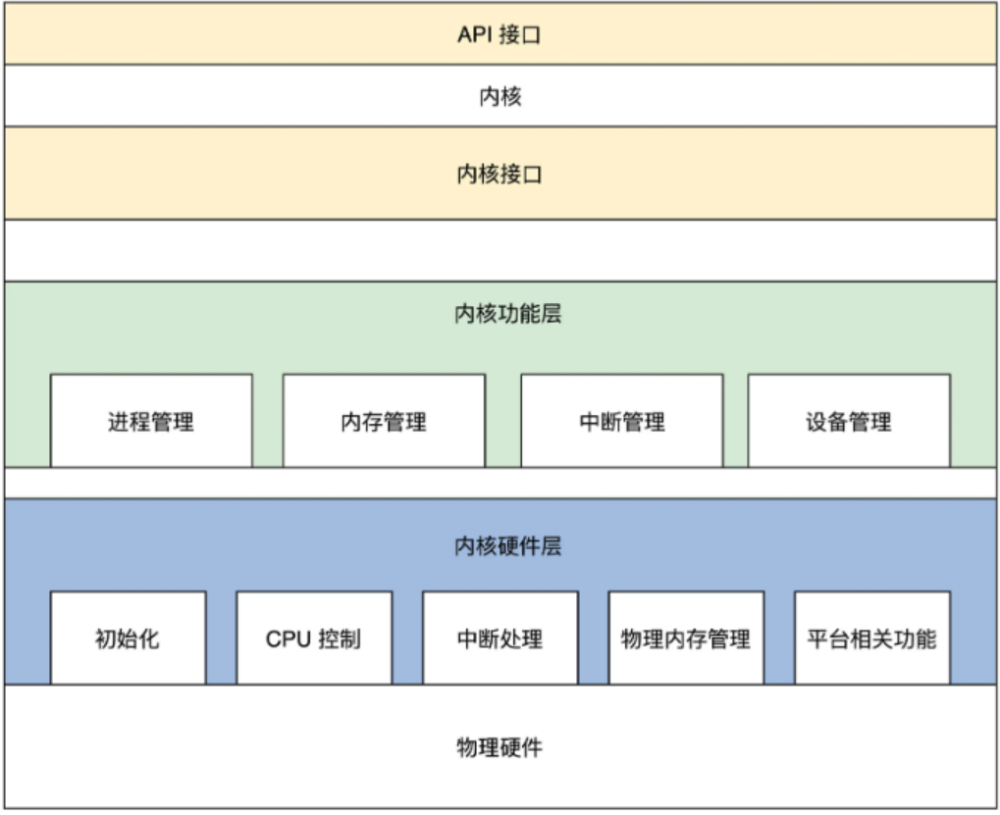
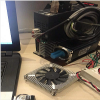
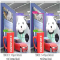

I received the M.Sc. degree in Electrical and Computer Engineering(major) and Computer Science(Minor) from University of Florida, United States, in 2021, respectively. My research interests include Security(IoT Security, Software Security, etc.), IoT/Embedded Systems(Control/Application).
<dl>
  <dd><a href="./files/HuXiao_CV.pdf">CV</a></dd>
  <dd><a href="./files/transcript_graduate.pdf">Transcript(Graduate)</a></dd>
  <dd><a href="./files/transcript_undergraduate.pdf">Transcript(Undergraduate)</a></dd>
</dl>

News
======
<ul>
  <li>[2022/10] Currently, I am looking for a PhD position in 2023</li>
  <li>[2022/07 - 2022/11] I am a remote research assistant under the supervision of Prof.<a href="https://cs.uwaterloo.ca/~m285xu/">Xu Meng</a> at the Unversity of Waterloo</li>
  <li>[2021/06 - 2022/06] I am a research assistant under the supervision of Prof.<a href="https://people.ucas.ac.cn/~jingzheng">Jingzheng Wu</a> at the Institute of Software, Chinese Academy of Sciences</li>
  <li>...</li>
</ul>

Education
======
<dl>
<dt>
  
</dt>
<dt>  University of Florida</dt>
<dd>&nbsp;  August 2019 - July 2021</dd>
<dd>&nbsp;  MS, Electrical and Computer Engineering (Major), Computer Science (Minor)</dd>
</dl>

<dl>
<dt>
  
</dt>
<dt>  East China Jiaotong University</dt>
<dd>&nbsp;  August 2015 - July 2019</dd>
<dd>&nbsp;  BE, Software Engineering + Track Traffic Signal and Control (Double Majors)</dd>
</dl>

 

Experience
======
<dl>
<dt>
  
</dt>
<dt>  Cheriton School of Computer Science at the University of Waterloo</dt>
<dd>&nbsp;  07/2022 - 11/2022</dd>
<dd>&nbsp;  Research Assistant(Part Time)</dd>
<dd>&nbsp;  Focus: System Security.</dd>
</dl>

<dl>
<dt>
  
</dt>
<dt>  Institute of Automation, Chinese Academy of Sciences</dt>
<dd>&nbsp;  02/2022 - 05/2022</dd>
<dd>&nbsp;  Research Assistant(Part Time)</dd>
<dd>&nbsp;  Focus: Autonomous driving robot.</dd>
</dl>

<dl>
<dt>
  
</dt>
<dt>  Institute of Software, Chinese Academy of Sciences</dt>
<dd>&nbsp;  05/2021 - 05/2022</dd>
<dd>&nbsp;  Research Assistant(Full Time)</dd>
<dd>&nbsp;  Focus: Robot systems security and PLC communication security.</dd>
</dl>

<dl>
<dt>
  
</dt>
<dt>  Institute of Computing, Chinese Academy of Sciences</dt>
<dd>&nbsp;  12/2020 - 03/2021</dd>
<dd>&nbsp;  Research Assistant(Part Time)</dd>
<dd>&nbsp;  Focus: Deep learning model compression.</dd>
</dl>

<dl>
<dt>
  
</dt>
<dt>  Institute of Automation, Chinese Academy of Sciences</dt>
<dd>&nbsp;  02/2018 - 04/2018</dd>
<dd>&nbsp;  Research Assistant(Full Time)</dd>
<dd>&nbsp;  Focus: PLC communication&control.</dd>
</dl>

 

Research Projects
======

System
------
<dl>
<dt>
  
</dt>
<dt text-align: left>A mixed-mode OS designed by me.</dt>
<dd text-align: left>Onging...</dd>
<dd text-align: left><a href="https://github.com/huxiao1/HuOS">[Link]</a></dd>
</dl>

Communication & Control
------
<dl>
<dt>
  
</dt>
<dt>  Double Layer Network Communication Based On Modbus Protocol</dt>
<dd>  Adopt double layer control protocol(Modebus/TCP & Modbus/RTU) to control the motor and large number of   lights and fans.</dd>
<dd>  <a href="http://www.cnki.com.cn/Article/CJFDTotal-DGJY201816010.htm">[Paper]</a>&nbsp;<a href="https://github.com/huxiao1/modbus.git">[Code]</a></dd>
</dl>

AI
------
<dl>
<dt>
  
</dt>
<dt>  Deep Learning Model Compression</dt>
<dd>&nbsp;  Apply quantify method to compress the AlexNet model and prune method to compress the Yolo V3 model so   that the models after compression can apply on the embedded platform.</dd>
<dd>&nbsp;&nbsp;&nbsp;&nbsp;&nbsp;&nbsp;&nbsp;&nbsp;&nbsp;&nbsp;&nbsp;&nbsp;&nbsp;&nbsp;&nbsp;&nbsp;&nbsp;&nbsp;&nbsp;&nbsp;&nbsp;&nbsp;&nbsp;&nbsp;&nbsp;&nbsp;  <a href="https://iopscience.iop.org/article/10.1088/1742-6596/2078/1/012047/meta">[Paper]</a>&nbsp;<a href="https://github.com/huxiao1/ai.git">[Code]</a></dd>
</dl>

Security
------
<dl>
<dt>
  
</dt>
<dt>  Robots Systems Security</dt>
<dd>&nbsp;  Develop agent programs on Vxworks, QNX, SylixOS and Linux robot systems to get the vulnerabilities and   system informations.</dd>
<dd>  <a href="#">[Not Open Sourced]</a></dd>
</dl>
