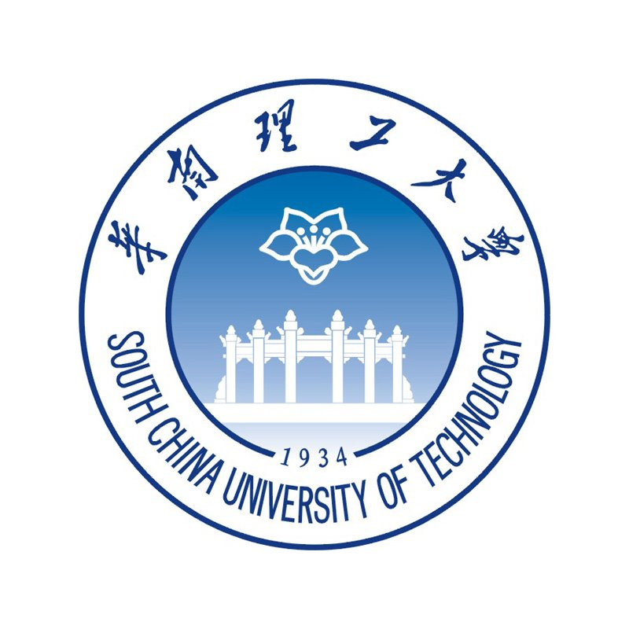
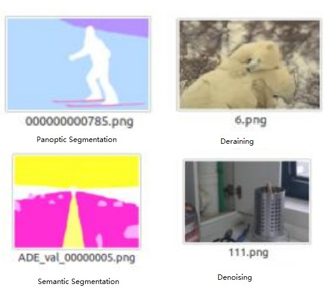
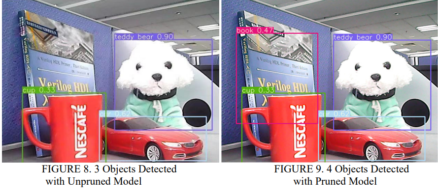
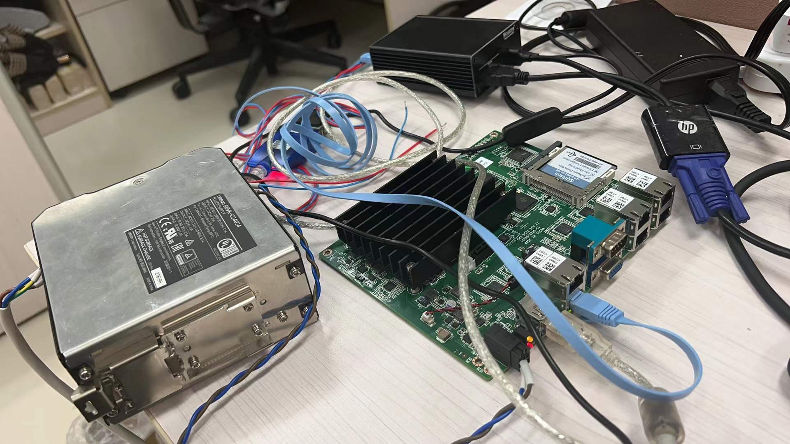

**Hao is currently a Machine Learning and Backend Developer at China Merchants Bank Co.,**  
He graduated with a B.Eng. in Artificial Technology and Science from South China University of Technology (SCUT). In 2021, he earned his M.Sc. degree in Electrical and Computer Engineering from the University of Florida.  
During his initial career phase, he applied Computer Vision and Natural Language Processing techniques to analyze health and log data within a mobile app, which boasts over 100 million users.  
His research interests are focused on Transfer Learning in Computer Vision using Large Language Models, AI for Systems, and the integration of AI with IoT (Internet of Things)."
<dl style="font-family: Arial, sans-serif; font-size: 14px;color: #333; text-align: left; border: 2px solid #3f51b5; padding: 10px; border-radius: 10px;">
  <dt>My Documents</dt>
  <dd class="link" style="background-color: #f2f2f2; border-radius: 10px; margin-bottom: 10px; padding: 10px;">
    <a href="./files/CV_research.pdf" style="color: black; text-decoration: none;">CV</a>
  </dd>
  <dd class="link" style="background-color: #f2f2f2; border-radius: 10px; margin-bottom: 10px; padding: 10px;">
    <a href="./files/transcript_graduate.pdf" style="color: black; text-decoration: none;">Transcript (Graduate)</a>
    <a href="./files/Diploma.pdf" style="color: black; text-decoration: none;">Certificate (Graduate)</a>
  </dd>
  <dd class="link" style="background-color: #f2f2f2; border-radius: 10px; margin-bottom: 10px; padding: 10px;">
    <a href="./files/Transcript_Undergraduate.pdf" style="color: black; text-decoration: none;">Transcript(Undergraduate)</a>
    <a href="./files/undergraduateTranscript.pdf" style="color: black; text-decoration: none;">Certificate (Undergraduate)</a>
  </dd>
  <!-- <dt>Tools</dt>
  <dd class="link" style="background-color: #f2f2f2; border-radius: 10px; margin-bottom: 10px; padding: 10px;">
    <a href="../time_diff.html" style="color: black; text-decoration: none;">Time Difference Between China and US</a>
  </dd>
  <dd class="link" style="background-color: #f2f2f2; border-radius: 10px; margin-bottom: 10px; padding: 10px;">
    <a href="../test.html" style="color: black; text-decoration: none;">My Calendar</a>
  </dd> -->

</dl>

News
======
<ul>
  <li>[2023/12] As a Machine Learning & Backend Developer, He is actively seeking opportunites as a PhD in AI and its Intersection Domain</li>
  <li>[2023/06 - Now] I am doing a research on devise a better multi-vision tasks generalist based on ViTs</li>
  <li>...</li>
</ul>

Education
======

<dl>
<dt>
  
</dt>
<dt>&nbsp;University of Florida</dt>
  <dd>&nbsp;August 2019 - December 2021</dd>
  <dd>&nbsp;M.Sc., Electrical and Computer Engineering (Major)</dd>
</dl>

<dl>
<dt>
  
</dt>
<dt>&nbsp;South China University of Technology</dt>
  <dd>&nbsp;August 2015 - July 2019</dd>
  <dd>&nbsp;B.Eng., Intelligent Science and Technology</dd>
</dl>

 

Experience
======
<dl>
  <dt>
    
  </dt>
  <dt style="text-align: left; padding-left: 10px;">&nbsp;  IT Department, China Merchants Bank (CMB) Co. Ltd.</dt>
  <dd style="text-align: left; padding-left: 10px;">&nbsp;  06/2022 - Now</dd>
  <dd style="text-align: left; padding-left: 10px;">&nbsp;  Machine Learning & Backend Engineer (Full Time)</dd>
  <dd style="text-align: left; padding-left: 10px;">&nbsp;  Focus: Application of Large Language Model (LLM) on System Availability and Reliability.</dd>
</dl>

<dl>
<dt>
  
</dt>
<dt style="text-align: left; padding-left: 10px;">&nbsp;  Institute of Computing, Chinese Academy of Sciences</dt>
<dd style="text-align: left; padding-left: 10px;">&nbsp;  12/2020 - 03/2021</dd>
<dd style="text-align: left; padding-left: 10px;">&nbsp;  Research Assistant (Part Time)</dd>
<dd style="text-align: left; padding-left: 10px;">&nbsp;  Focus: Deep learning model compression.</dd>
</dl>

 

Research Projects
======

  
Vision-Language Model research
------

  <dt>
  
  </dt>
<dl>
  <dt style="text-align: left; padding-left: 15px;">Large Language Model Application: A General Multi-vision-tasks LLM</dt>
  <dd style="text-align: left; padding-left: 10px;">Inspired by the Vision Transformer (ViT) model, we have employed the Masked Autoencoder (MAE) mechanism to fine-tune a pre-trained large language model (LLM). This approach has significantly enhanced our multi-task vision generalist model. The improved model now excels in various tasks, including image denoising, rain removal (deraining), panoptic segmentation, and semantic segmentation, among others</dd>
  <dd style="text-align: left; padding-left: 10px;"><a href="#">[Not Open Sourced]</a></dd>
</dl>

Model Compression
------

  
  

<dl>
  <dt style="text-align: left; padding-left: 15px;">Deep Learning Model Compression</dt>
  <dd style="text-align: left; padding-left: 10px;">In this paper, we experimented with using two tricks for model compression: Pruning and Quantization. By utilizing these methods, we got a remarkable improvement in model simplification while retaining a relatively close accuracy.</dd>
<dd style="text-align: left; padding-left: 10px;"><a href="https://iopscience.iop.org/article/10.1088/1742-6596/2078/1/012047/meta">[Paper]</a>&nbsp;<a href="https://github.com/WenhaoRichard/ModelCompression">[Code]</a></dd>
</dl>

