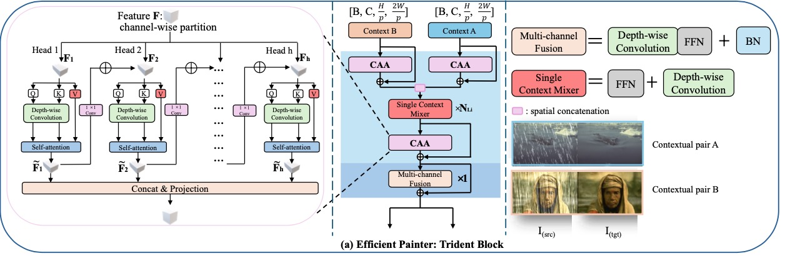

  

  
Entering Hao Wen Universe · AI for ISP + Deep Learning

  <section class="hero-panel">
    <h1 class="hero-title">👋 你好，我是文豪（Hao Wen）</h1>
    

      <strong>AI for ISP + Deep Learning.</strong> 
      我专注于把 AI 算法真正推到 production：从 research prototype 到 robust deployment。 
      Building fascinating, reliable intelligence for real-world systems — <em>from pixels to platforms</em>.
    

  </section>

  

    <article class="cool-card">
      <h3>🚀 Focus Now</h3>
      
面向真实业务场景，持续推进 AI 在系统可靠性、可观测性与自动化中的落地。

    </article>
    <article class="cool-card">
      <h3>🧠 Research Interests</h3>
      
Vision-Language Models、模型鲁棒性与安全、AI for Systems、AIGC + IoT。

    </article>
    <article class="cool-card">
      <h3>🎯 Style</h3>
      
Data-driven + engineering-first。重视 latency、cost、stability，也重视“wow effect”。

    </article>
  

  <section class="core-zone">
    <h2>🔬 Featured Project</h2>
    
    <ul>
      <li><strong>Efficient In-context Visual Learning</strong>：在图像去噪、去雨等任务兼顾速度与精度。</li>
      <li><strong>Model Compression</strong>：通过剪枝与量化减少开销并尽可能保持性能。</li>
    </ul>
  </section>

  <section class="core-zone">
    <h2>📎 Documents</h2>
    <ul>
      <li><a href="./files/CV_research.pdf">CV</a></li>
      <li><a href="./files/transcript_graduate.pdf">Transcript (Graduate)</a></li>
      <li><a href="./files/Diploma.pdf">Certificate (Graduate)</a></li>
      <li><a href="./files/Transcript_Undergraduate.pdf">Transcript (Undergraduate)</a></li>
      <li><a href="./files/undergraduateTranscript.pdf">Certificate (Undergraduate)</a></li>
    </ul>
  </section>

  <section class="message-board">
    <h2>📝 留言板</h2>
    <form id="guestbook-form">
      <input id="guest-name" type="text" maxlength="30" placeholder="你的昵称（必填）" required>
      <textarea id="guest-message" rows="4" maxlength="280" placeholder="留下点什么吧（最多 280 字）" required></textarea>
      <button type="submit">发布留言</button>
    </form>
    

    
当前为轻量本地留言板（浏览器本地存储）。

  </section>

  

    PV: <strong id="busuanzi_value_site_pv">...</strong>
    UV: <strong id="busuanzi_value_site_uv">...</strong>
  

